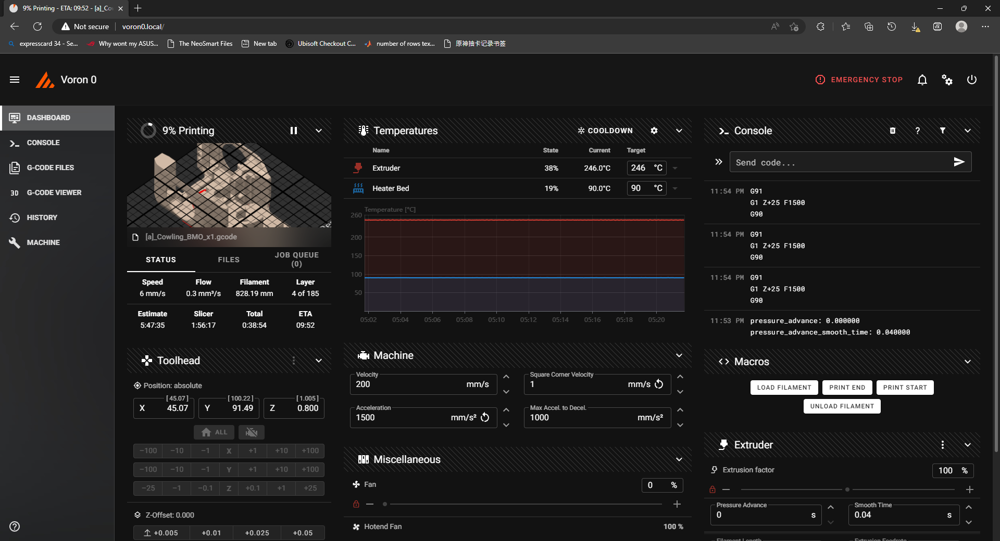

# industrial-mainsail-theme
This is a theme for  <a href="https://docs.mainsail.xyz">Mainsail</a>.

## Setup
At "MACHINE" page, create a ".theme" folder in config folder.

The folder may not show up, in that case, click on the small gear on top right of that card and check "hidden files".

upload the "sidebar-background.png" and "custom.css" files to that folder.

Set the primary color to white (it looks great :D).

Refresh the webpage.

## Preview

## What's modified
Header style

Nav bar style (blurry effect, height)

Cards become transparent

Modded animation curve
